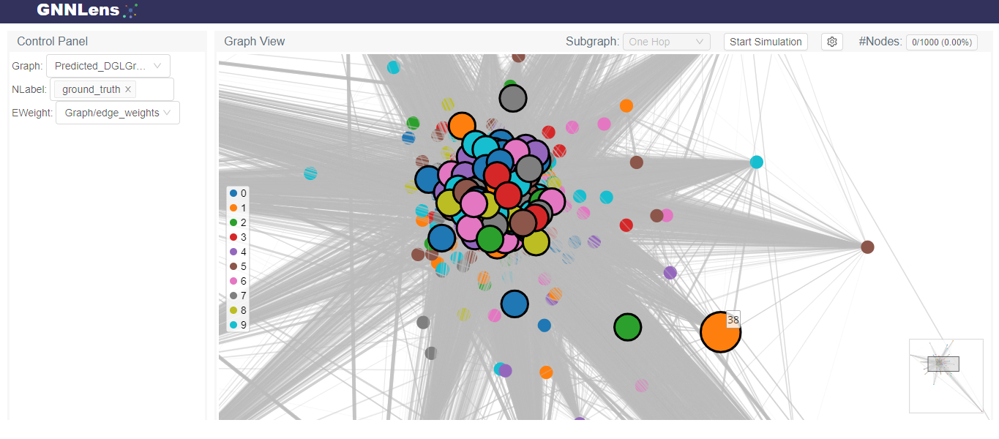

# Linkedin Graph Neural Networks Project


This a personal project created by [Alexander Quesada Quesada](https://www.linkedin.com/in/alexander-quesada-quesada-b91348259/), the goal is to simulate Linkedin job postings as nodes in a graph and create edges between nodes that satisfy specific requierments, those connections represent similarity between two jobs, and they will also have weights from 0 to 1 representing the strength of that similarity.

**This project includes two different types of Deep Learning Models:**

* GNN (Graph Neural Network) model that predicts new connections between nodes after a cautious and meticulous training process where it learns the patterns of the pre-established edges to come up with new ones.

* XGBoost model that applies regression learning to predict  weights (strength) for all the previously predicted
new connections between nodes.

**The workflow or project pipeline consists on:**  

1. Loading and Merging the CSV different files into pandas datasets.

2. Cleaning, encoding and polishing further details of the merged pandas dataset.

3. Preparing the data as matrices that PyTorch Geometric library can understand and convert into [PyTorch Geometric Graph Data](https://pytorch-geometric.readthedocs.io/en/latest/modules/datasets.html).

4. Plotting some examples of the PyTorch Geometric Graph Data

5. Preparing both Training and Testing Data.

6. [Model Creation (by Orbifold)](https://github.com/Orbifold/pyg-link-prediction/blob/main/run.py#L22), batching, training and evaluating GNN model's performance.

7. Creating and Training the XGBoost model.

8. Create the final function that predicts all possible new connections and their corresponding weights for all nodes within some input graph, by using the previous mentioned models.

9. Unit Testing the combined Deep Learning Pipeline's predictions and perfomance.

10. Use [GNNLens2](https://github.com/dmlc/GNNLens2) for graph visualization, with the Deep Learning Pipeline's results included.

11. Public Repository Creating and Web Deployment of this App.


## Code

> **WARNING:** Please use the Google Colab link for running the code as it is the optimal choice in terms of resources, comfort and error-free guarantee.

- [(Google Colab) Implementation for running and testing](https://colab.research.google.com/drive/1a1V229rw7qFSgOZEej05VIZKsePwit3a?usp=sharing)
- [Source code](src/Linkedin_Graph_Neural_Networks_Project.ipynb)
  




## Data info

---

[This dataset](https://www.kaggle.com/datasets/arshkon/linkedin-job-postings) comprises over 33,000 job postings gathered from LinkedIn over two separate days, offering a comprehensive snapshot of job opportunities. Each posting includes 27 attributes such as title, job description, salary, location, application URL, and work type (remote, contract, etc). Additional files contain information on benefits, skills, and industries associated with each posting. The dataset also links jobs to companies, with a separate CSV file providing details on each company, including description, headquarters location, number of employees, and follower count.

---

### job_postings.csv

- `job_id`: The job ID as defined by [LinkedIn](https://www.linkedin.com/jobs/view/job_id).
- `company_id`: Identifier for the company associated with the job posting (maps to companies.csv).
- `title`: Job title.
- `description`: Job description.
- `max_salary`: Maximum salary.
- `med_salary`: Median salary.
- `min_salary`: Minimum salary.
- `pay_period`: Pay period for salary (Hourly, Monthly, Yearly).
- `formatted_work_type`: Type of work (Fulltime, Parttime, Contract).
- `location`: Job location.
- `applies`: Number of applications that have been submitted.
- `original_listed_time`: Original time the job was listed.
- `remote_allowed`: Whether the job permits remote work.
- `views`: Number of times the job posting has been viewed.
- `job_posting_url`: URL to the job posting on a platform.
- `application_url`: URL where applications can be submitted.
- `application_type`: Type of application process (offsite, complex/simple onsite).
- `expiry`: Expiration date or time for the job listing.
- `closed_time`: Time to close job listing.
- `formatted_experience_level`: Job experience level (entry, associate, executive, etc).
- `skills_desc`: Description detailing required skills for the job.
- `listed_time`: Time when the job was listed.
- `posting_domain`: Domain of the website with the application.
- `sponsored`: Whether the job listing is sponsored or promoted.
- `work_type`: Type of work associated with the job.
- `currency`: Currency in which the salary is provided.
- `compensation_type`: Type of compensation for the job.
‎

### job_details/benefits.csv

- `job_id`: The job ID.
- `type`: Type of benefit provided (401K, Medical Insurance, etc).
- `inferred`: Whether the benefit was explicitly tagged or inferred through text by LinkedIn.

### company_details/companies.csv

- `company_id`: The company ID as defined by LinkedIn.
- `name`: Company name.
- `description`: Company description.
- `company_size`: Company grouping based on the number of employees (0 Smallest - 7 Largest).
- `country`: Country of the company headquarters.
- `state`: State of the company headquarters.
- `city`: City of the company headquarters.
- `zip_code`: ZIP code of the company's headquarters.
- `address`: Address of the company's headquarters.
- `url`: Link to the company's LinkedIn page.

### company_details/employee_counts.csv

- `company_id`: The company ID.
- `employee_count`: Number of employees at the company.
- `follower_count`: Number of company followers on LinkedIn.
- `time_recorded`: Unix time of data collection.

---

*CC BY-SA 4.0*

*By ARSH KON*

---


## How to run source code

This proyect can be readed and tested at:

* [IPYNB GoogleColab](https://colab.research.google.com/drive/1a1V229rw7qFSgOZEej05VIZKsePwit3a?usp=sharing)

By pressing ``CTRL + F9``

### How to run locally (Must have at least 16 RAM and 1GB of free space)

#### Using `pipreqs` to Generate `requirements.txt`

* Step 1: Clone the Project

```bash
git clone https://github.com/papitaAlgodonCplusplus/Linkedin-Graph-Neural-Networks-Project.git
cd Linkedin-Graph-Neural-Networks-Project
```

* Step 2: Install pipreqs

```bash
pip install pipreqs
```

* Step 3: Install requirements

```bash
pip install -r requirements.txt
```

#### Running the src code

```bash
cd src
python3 linkedin_graph_neural_networks_project.py 
```

#### Running test suite

```bash
cd src
python3 test_suite.py 
```

## How to the Web App

To run the web app, you'll need to install [Streamlit](https://streamlit.io/) from your command line and run the python app, by typing:

```bash
pip install streamlit

streamlit run web_app.py
```

## Questions & Feedback

If you have any questions about the proyect, suggestions or want to spot a mistake, please let me know by creating a new issue or writing me at:

<ALEXANDER.QUESADAQUESADA@ucr.ac.cr>

## License

See the LICENSE file for license rights and limitations (MIT).